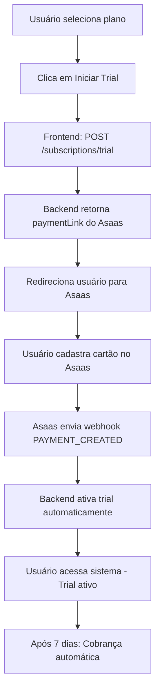

# Especificação de Implementação - Trial com Validação de Cartão

**Data:** 8 de outubro de 2025  
**Versão da API:** v1  
**Status:** ✅ Implementado no Backend  
**Responsável Frontend:** [Nome do Dev Frontend]

---

## 📋 Resumo Executivo

Implementamos no backend um novo fluxo de **Trial Gratuito com Validação de Cartão Obrigatória** integrado ao Asaas. O usuário precisa cadastrar um cartão de crédito para liberar o período de teste, mas **não será cobrado durante os 7 dias de trial**.

### Diferencial desta implementação:
- ✅ Trial de 7 dias **realmente grátis** (sem cobrança)
- ✅ Validação de cartão obrigatória (via Asaas)
- ✅ Cobrança automática após o trial
- ✅ Ativação instantânea após cadastro do cartão

---

## 🎯 Objetivo da Feature

Permitir que usuários testem o produto por **7 dias gratuitamente**, mas com a **segurança de um cartão válido** cadastrado. Após o trial, a cobrança é feita automaticamente.

---

## 🔄 Fluxo do Usuário



---

## 🛠️ Implementação Frontend

### 1️⃣ Endpoint: Criar Trial

#### Request

```http
POST {{baseUrl}}/api/v1/subscriptions/trial
Authorization: Bearer {{authToken}}
Content-Type: application/json

{
  "produtoId": "550e8400-e29b-41d4-a716-446655440000",
  "asaasCustomerId": "cus_000005730118",
  "trialDays": 7
}
```

#### Request Body Schema

```typescript
interface CreateTrialRequest {
  produtoId: string;        // UUID do produto/plano selecionado
  asaasCustomerId: string;  // ID do cliente no Asaas (necessário criar antes)
  trialDays?: number;       // Opcional. Default: 7 dias
}
```

#### Response Success (201)

```json
{
  "success": true,
  "data": {
    "subscription": {
      "id": "uuid-da-subscription",
      "empresaId": "uuid-da-empresa",
      "produtoId": "uuid-do-produto",
      "status": "pending_payment_method",
      "asaasSubscriptionId": "sub_xxxxx",
      "asaasInvoiceUrl": "https://www.asaas.com/i/xxxxx",
      "trialEndsAt": null,
      "nextDueDate": "2025-10-15T00:00:00.000Z",
      "createdAt": "2025-10-08T14:30:00.000Z"
    },
    "invoiceUrl": "https://www.asaas.com/i/xxxxx",
    "message": "Trial criado. Redirecione o usuário para cadastrar o cartão."
  }
}
```

#### Response Error (400)

```json
{
  "success": false,
  "error": "Já existe uma assinatura ativa para este produto"
}
```

#### Response Error (500)

```json
{
  "success": false,
  "error": "Erro ao criar trial no Asaas"
}
```

---

### 2️⃣ Fluxo de Implementação no Frontend

#### Passo 1: Criar Cliente no Asaas (se ainda não existir)

Antes de criar o trial, você precisa ter um `asaasCustomerId`. Verifique se já existe um cliente Asaas vinculado à empresa. Caso não exista, crie usando o endpoint existente de clientes.

**Exemplo:**
```typescript
// Verificar se empresa já tem asaasCustomerId
const empresa = await getEmpresaAtual();

if (!empresa.asaas_customer_id) {
  // Criar cliente no Asaas
  const customerResponse = await createAsaasCustomer({
    name: empresa.nome_fantasia,
    cpfCnpj: empresa.cnpj,
    email: empresa.email
  });
  
  empresa.asaas_customer_id = customerResponse.id;
}
```

#### Passo 2: Chamar Endpoint de Trial

```typescript
async function iniciarTrial(produtoId: string, asaasCustomerId: string) {
  try {
    const response = await fetch(`${API_BASE_URL}/api/v1/subscriptions/trial`, {
      method: 'POST',
      headers: {
        'Authorization': `Bearer ${authToken}`,
        'Content-Type': 'application/json'
      },
      body: JSON.stringify({
        produtoId,
        asaasCustomerId,
        trialDays: 7 // Opcional
      })
    });

    const data = await response.json();

    if (!response.ok) {
      throw new Error(data.error || 'Erro ao criar trial');
    }

    return data.data;
  } catch (error) {
    console.error('Erro ao iniciar trial:', error);
    throw error;
  }
}
```

#### Passo 3: Redirecionar para Asaas

```typescript
const trialData = await iniciarTrial(produtoId, asaasCustomerId);

// Mostrar mensagem ao usuário
alert('Você será redirecionado para cadastrar seu cartão de crédito. Não se preocupe, você não será cobrado durante o período de teste!');

// Redirecionar para o link de pagamento do Asaas
window.location.href = trialData.invoiceUrl;
```

#### Passo 4: Página de Retorno (após cadastro do cartão)

Após o usuário cadastrar o cartão no Asaas, ele será redirecionado de volta para sua aplicação. Configure uma página de "Sucesso" que:

1. Mostre mensagem de confirmação
2. Explique que o trial foi ativado
3. Redirecione para o dashboard

```typescript
// Página: /trial/success
function TrialSuccessPage() {
  useEffect(() => {
    // Opcional: polling para verificar se o trial já foi ativado pelo webhook
    const checkTrialStatus = async () => {
      const subscriptions = await fetchUserSubscriptions();
      const trialSubscription = subscriptions.find(s => s.status === 'trialing');
      
      if (trialSubscription) {
        // Trial ativado! Redirecionar para dashboard
        setTimeout(() => {
          router.push('/dashboard');
        }, 3000);
      }
    };

    const interval = setInterval(checkTrialStatus, 2000);
    return () => clearInterval(interval);
  }, []);

  return (
    <div className="success-container">
      <h1>🎉 Trial Ativado com Sucesso!</h1>
      <p>Seu período de teste de 7 dias foi ativado.</p>
      <p>Você será cobrado automaticamente após o término do trial.</p>
      <p>Redirecionando para o dashboard...</p>
    </div>
  );
}
```

---

### 3️⃣ Estados da Subscription

A subscription pode ter os seguintes status durante o fluxo de trial:

| Status | Descrição | Ação do Frontend |
|--------|-----------|------------------|
| `pending_payment_method` | Aguardando cadastro de cartão | Mostrar "Aguardando pagamento..." |
| `trialing` | Trial ativo | Permitir acesso total ao sistema |
| `active` | Assinatura ativa (após trial) | Permitir acesso total ao sistema |
| `past_due` | Pagamento atrasado | Mostrar alerta de pagamento |
| `canceled` | Cancelada pelo usuário | Bloquear acesso |
| `suspended` | Suspensa por inadimplência | Bloquear acesso |
| `expired` | Expirada | Bloquear acesso |

---

### 4️⃣ UI/UX Sugerida

#### Tela de Seleção de Plano

```tsx
function PlanSelection() {
  const [selectedPlan, setSelectedPlan] = useState<string | null>(null);

  const handleStartTrial = async (produtoId: string) => {
    try {
      setLoading(true);
      
      // Criar ou obter asaasCustomerId
      const customerId = await getOrCreateAsaasCustomer();
      
      // Iniciar trial
      const trialData = await iniciarTrial(produtoId, customerId);
      
      // Redirecionar para Asaas
      window.location.href = trialData.invoiceUrl;
      
    } catch (error) {
      toast.error(error.message);
    } finally {
      setLoading(false);
    }
  };

  return (
    <div className="plans-container">
      {plans.map(plan => (
        <div key={plan.id} className="plan-card">
          <h3>{plan.nome}</h3>
          <p className="price">R$ {plan.valor}/mês</p>
          <ul>
            {plan.features.map(feature => (
              <li key={feature}>{feature}</li>
            ))}
          </ul>
          <button 
            onClick={() => handleStartTrial(plan.id)}
            className="btn-trial"
          >
            🎁 Testar Grátis por 7 Dias
          </button>
          <p className="trial-info">
            Cadastre seu cartão sem cobrança imediata
          </p>
        </div>
      ))}
    </div>
  );
}
```

#### Modal de Confirmação (opcional)

```tsx
function TrialConfirmationModal({ plan, onConfirm, onCancel }) {
  return (
    <Modal>
      <h2>Iniciar Trial de 7 Dias</h2>
      <p>Você selecionou o plano <strong>{plan.nome}</strong></p>
      
      <div className="trial-details">
        <h3>Como funciona:</h3>
        <ul>
          <li>✅ 7 dias de acesso completo grátis</li>
          <li>✅ Cadastre seu cartão de crédito (sem cobrança)</li>
          <li>✅ Cancele a qualquer momento</li>
          <li>💳 Cobrança automática após 7 dias: R$ {plan.valor}/mês</li>
        </ul>
      </div>

      <p className="next-charge">
        Próxima cobrança: {formatDate(addDays(new Date(), 7))}
      </p>

      <div className="modal-actions">
        <button onClick={onCancel}>Cancelar</button>
        <button onClick={onConfirm} className="btn-primary">
          Continuar para Cadastro de Cartão
        </button>
      </div>
    </Modal>
  );
}
```

---

## 🔐 Autenticação e Segurança

### Headers Obrigatórios

```typescript
{
  'Authorization': 'Bearer <JWT_TOKEN>',
  'Content-Type': 'application/json'
}
```

O JWT é obtido no login e contém:
- `user.id`: ID do usuário
- `empresa_id`: ID da empresa (usado automaticamente pelo backend)

---

## 📊 Integrações Necessárias

### 1. Endpoint de Listagem de Produtos (já existe)

```http
GET {{baseUrl}}/api/v1/produtos?tipo=recorrente&ativo=true
Authorization: Bearer {{authToken}}
```

### 2. Endpoint de Listagem de Subscriptions (já existe)

```http
GET {{baseUrl}}/api/v1/subscriptions?empresaId={{empresaId}}
Authorization: Bearer {{authToken}}
```

Use para verificar subscriptions ativas antes de oferecer trial.

---

## ⚠️ Validações e Regras de Negócio

### Validações no Backend (já implementadas):

1. ✅ **Produto deve ser recorrente** - Trials só funcionam com produtos de assinatura
2. ✅ **Produto deve estar ativo** - Não permitir trial de produtos desativados
3. ✅ **Sem duplicação** - Não permitir criar trial se já existe subscription ativa/trialing/pending para o mesmo produto
4. ✅ **Cliente Asaas obrigatório** - `asaasCustomerId` é required

### Validações no Frontend (implementar):

1. ⚠️ **Verificar se empresa tem CNPJ válido** antes de criar trial
2. ⚠️ **Verificar se usuário já tem trial/assinatura ativa** antes de mostrar botão
3. ⚠️ **Mostrar mensagem clara** sobre quando será cobrado
4. ⚠️ **Validar redirect de retorno** do Asaas

---

## 🧪 Testes Sugeridos

### Cenários de Teste:

1. **Trial Completo (Fluxo Feliz)**
   - Criar trial
   - Cadastrar cartão no Asaas
   - Verificar ativação automática
   - Aguardar 7 dias (ou simular webhook)
   - Verificar cobrança

2. **Tentativa de Duplicação**
   - Criar trial
   - Tentar criar outro trial para o mesmo produto
   - Verificar erro 400

3. **Erro no Asaas**
   - Simular erro na API do Asaas
   - Verificar tratamento de erro
   - Verificar mensagem ao usuário

4. **Cancelamento de Cartão**
   - Criar trial
   - Usuário fecha página do Asaas sem cadastrar cartão
   - Verificar que subscription fica em `pending_payment_method`
   - Permitir retry

---

## 📝 Mensagens Sugeridas para o Usuário

### Antes de Redirecionar:
```
🎁 Seu trial de 7 dias está quase pronto!

Você será redirecionado para cadastrar seu cartão de crédito.

⚠️ Não se preocupe: você NÃO será cobrado agora!

A cobrança só acontecerá após 7 dias, no valor de R$ 97,00/mês.
Você pode cancelar a qualquer momento antes disso.
```

### Após Cadastro de Cartão:
```
🎉 Trial Ativado com Sucesso!

Seu período de teste de 7 dias começou agora.

Você tem acesso completo a todos os recursos do plano [Nome do Plano].

📅 Próxima cobrança: 15/10/2025
💳 Valor: R$ 97,00

Aproveite! 🚀
```

### Se Subscription estiver Pending:
```
⏳ Aguardando confirmação do cartão...

Ainda não recebemos a confirmação do seu cartão de crédito.

Se você fechou a página do Asaas sem concluir, clique abaixo para tentar novamente:

[Cadastrar Cartão Agora]
```

---

## 🐛 Tratamento de Erros

### Erros Possíveis e Como Tratar:

| Código | Erro | Ação do Frontend |
|--------|------|------------------|
| 400 | "Produto não encontrado" | Mostrar erro e voltar para seleção de planos |
| 400 | "Produto não é recorrente" | Não mostrar botão de trial para este produto |
| 400 | "Já existe assinatura ativa" | Mostrar "Você já tem uma assinatura ativa" |
| 401 | "Não autenticado" | Redirecionar para login |
| 500 | "Erro ao criar trial no Asaas" | Mostrar erro genérico e permitir retry |

### Exemplo de Tratamento:

```typescript
try {
  const trialData = await iniciarTrial(produtoId, asaasCustomerId);
  window.location.href = trialData.invoiceUrl;
} catch (error) {
  if (error.status === 400) {
    if (error.message.includes('Já existe')) {
      toast.error('Você já possui uma assinatura ativa para este plano.');
      router.push('/dashboard/subscriptions');
    } else {
      toast.error(error.message);
    }
  } else if (error.status === 401) {
    toast.error('Sessão expirada. Faça login novamente.');
    router.push('/login');
  } else {
    toast.error('Erro ao processar seu pedido. Tente novamente.');
  }
}
```

---

## 📱 Responsividade

O redirect para Asaas funciona em:
- ✅ Desktop (abre em nova aba)
- ✅ Mobile (abre no navegador nativo)
- ✅ WebView (caso aplicação seja híbrida)

---

## 🔗 Links Úteis

- **Documentação Asaas:** https://docs.asaas.com/
- **API Swagger (Backend):** http://localhost:3000/api-docs
- **Testes de Contrato:** `/contract-first/subscriptions/trial.http`

---

## 📞 Suporte

Em caso de dúvidas:
1. Verificar logs do backend em `/logs`
2. Testar endpoint via Swagger UI
3. Contatar time de backend: [email do time]

---

## ✅ Checklist de Implementação

### Frontend:

- [ ] Criar página de seleção de planos com botão "Testar Grátis"
- [ ] Implementar função `iniciarTrial()`
- [ ] Implementar redirect para Asaas
- [ ] Criar página de retorno/sucesso (`/trial/success`)
- [ ] Implementar verificação de status da subscription
- [ ] Adicionar tratamento de erros
- [ ] Implementar modal de confirmação (opcional)
- [ ] Adicionar mensagens explicativas sobre cobrança
- [ ] Testar fluxo completo em desenvolvimento
- [ ] Validar responsividade (desktop + mobile)

### Testes:

- [ ] Testar criação de trial
- [ ] Testar redirect para Asaas
- [ ] Testar cadastro de cartão
- [ ] Testar ativação automática (webhook)
- [ ] Testar tentativa de duplicação
- [ ] Testar cancelamento (usuário fecha Asaas)
- [ ] Testar erros de validação

---

## 🚀 Pronto para Começar!

O backend está 100% funcional e testado. Qualquer dúvida durante a implementação, não hesite em perguntar!

**Boa sorte! 🎉**
