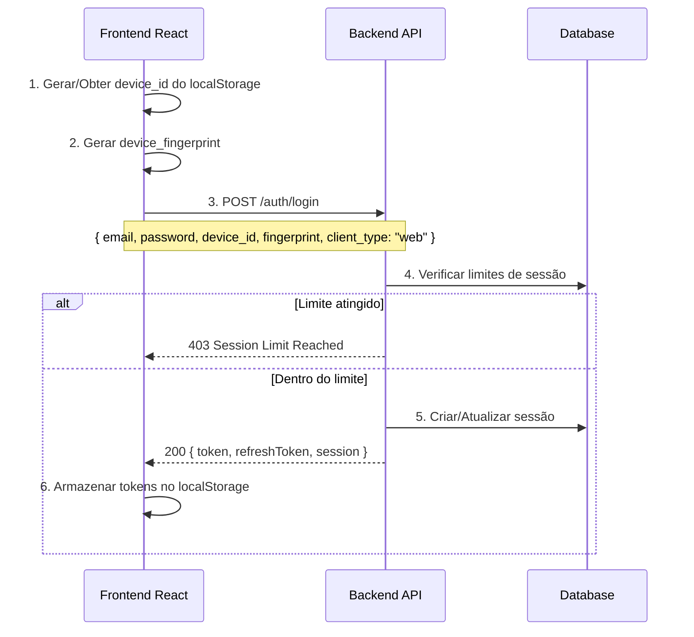
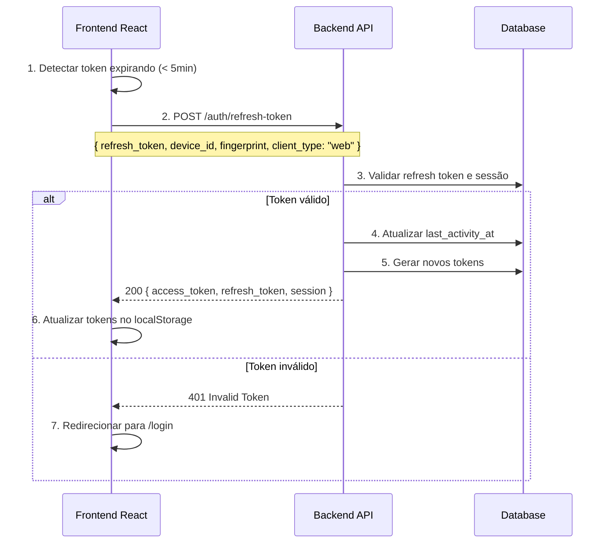

# Guia de Integração - Frontend React
## LeadsRapido Backend API - Sistema de Sessões e Licenças

**Versão:** 1.0.0
**Data:** 2025-10-01
**Público:** Desenvolvedores do Frontend React

---

## 📋 Índice

1. [Visão Geral](#visão-geral)
2. [Arquitetura de Sessões](#arquitetura-de-sessões)
3. [Controle de Licenças](#controle-de-licenças)
4. [Autenticação e Sessões](#autenticação-e-sessões)
5. [Endpoints da API](#endpoints-da-api)
6. [Integração com React](#integração-com-react)
7. [Códigos de Erro](#códigos-de-erro)
8. [Boas Práticas](#boas-práticas)
9. [Exemplos de Código](#exemplos-de-código)

---

## 🎯 Visão Geral

O LeadsRapido implementa um **sistema unificado de sessões** que permite que o frontend React e a extensão Chrome compartilhem a mesma sessão através de um `device_id` comum. Isso significa:

- ✅ **Uma única sessão** por dispositivo (compartilhada entre web e extensão)
- ✅ **Controle de licenças** baseado no plano da empresa
- ✅ **Diferenciação de cliente** via campo `client_type: 'web'`
- ✅ **Sincronização automática** de atividade entre clientes
- ✅ **Auditoria completa** de todas as operações

### Diferenciação entre Frontend e Extensão

| Aspecto | Frontend React | Extensão Chrome |
|---------|----------------|-----------------|
| **client_type** | `web` | `extension` |
| **device_id** | Mesmo UUID compartilhado | Mesmo UUID compartilhado |
| **Sessão** | Compartilhada | Compartilhada |
| **Licença** | Conta como 1 device_id único | Conta como 1 device_id único |
| **Storage** | localStorage / sessionStorage | chrome.storage.local / chrome.storage.sync |

---

## 🏗️ Arquitetura de Sessões

### Modelo de Sessão Compartilhada

```
┌─────────────────────────────────────────────────────┐
│           Dispositivo (device_id único)             │
│                                                     │
│  ┌──────────────────┐      ┌──────────────────┐   │
│  │  Frontend React  │      │ Extensão Chrome  │   │
│  │  client_type:    │◄────►│  client_type:    │   │
│  │  "web"           │      │  "extension"     │   │
│  └──────────────────┘      └──────────────────┘   │
│           │                         │              │
│           └─────────┬───────────────┘              │
│                     ▼                              │
│            ┌────────────────┐                      │
│            │  Sessão Única  │                      │
│            │  (user_session)│                      │
│            └────────────────┘                      │
└─────────────────────────────────────────────────────┘
```

### Entidade UserSession

```typescript
interface UserSession {
  id: string;                    // UUID da sessão
  user_id: string;               // UUID do usuário
  empresa_id: string;            // UUID da empresa
  device_id: string;             // UUID compartilhado (CRÍTICO!)
  refresh_token_hash: string;    // Hash do refresh token
  device_fingerprint: string;    // Impressão digital do dispositivo
  ip_address: string | null;     // IP do último acesso
  user_agent: string | null;     // User agent do último acesso
  client_type: 'web' | 'extension'; // Tipo do último cliente ativo
  status: 'active' | 'expired' | 'revoked' | 'suspicious';
  created_at: Date;
  last_activity_at: Date;        // Atualizado por ambos os clientes
  expires_at: Date;              // 45 minutos de inatividade
  metadata: object;
}
```

### Estados da Sessão

| Status | Descrição | Ação do Frontend |
|--------|-----------|------------------|
| `active` | Sessão válida e ativa | Usar normalmente |
| `expired` | Expirou por inatividade (45min) | Fazer refresh token |
| `revoked` | Revogada manualmente | Fazer novo login |
| `suspicious` | Atividade suspeita detectada | Alertar usuário e reautenticar |

---

## 🔐 Controle de Licenças

### Sistema de Limites de Sessão

O controle de licenças é baseado em **device_ids únicos**, não em `client_type`. Isso significa:

- **1 device_id = 1 licença** (independente de quantos clientes usam)
- Frontend e extensão no **mesmo dispositivo** = **1 licença apenas**
- Frontend e extensão em **dispositivos diferentes** = **2 licenças**

### Limites por Plano

```typescript
enum CompanyPlan {
  FREEMIUM = 'freemium',    // 1 dispositivo simultâneo
  BASICO = 'basico',        // 2 dispositivos simultâneos
  PREMIUM = 'premium',      // 5 dispositivos simultâneos
  ENTERPRISE = 'enterprise' // 10 dispositivos simultâneos
}
```

### Entidade EmpresaSessionLimits

```typescript
interface EmpresaSessionLimits {
  empresa_id: string;
  max_concurrent_sessions: number;      // Limite do plano
  current_active_sessions: number;      // Contador atual (device_ids únicos)
  enforcement_mode: 'block' | 'warn' | 'allow_with_audit';
  created_at: Date;
  updated_at: Date;
  updated_by: string | null;
}
```

### Enforcement Modes

| Modo | Comportamento | Quando Usar |
|------|---------------|-------------|
| `block` | Bloqueia novos logins ao atingir limite | **Padrão** - produção |
| `warn` | Permite mas exibe avisos | Testes, desenvolvimento |
| `allow_with_audit` | Permite mas registra em auditoria | Monitoramento, transição |

---

## 🔑 Autenticação e Sessões

### Fluxo de Login



### Fluxo de Refresh Token



---

## 🌐 Endpoints da API

### Base URL

```typescript
const API_BASE_URL = {
  production: 'https://api.publix.ia.br/api/v1',
  staging: 'https://staging-api.publix.ia.br/api/v1',
  development: 'http://localhost:3000/api/v1'
};
```

### 1. Login

**POST** `/auth/login`

**Request Headers:**
```typescript
{
  "Content-Type": "application/json",
  "X-Device-Id": "550e8400-e29b-41d4-a716-446655440000"
}
```

**Request Body:**
```typescript
{
  email: string;
  password: string;
  device_id: string;           // UUID persistente do navegador
  device_fingerprint: string;  // Fingerprint do dispositivo
  client_type: "web";          // SEMPRE "web" para o frontend
}
```

**Response 200:**
```typescript
{
  success: true,
  data: {
    token: string;                  // JWT access token
    refreshToken: string;           // JWT refresh token
    user: {
      id: string;
      email: string;
      nome: string;
      empresa_id: string;
      role: string;
    },
    empresa: {
      id: string;
      nome: string;
      cnpj: string;
    },
    session: {
      id: string;
      device_id: string;
      client_type: "web";
      expires_at: string;
      time_to_expiration_minutes: number;
    }
  }
}
```

**Response 403 - Limite Atingido:**
```typescript
{
  success: false,
  error: {
    code: "SESSION_LIMIT_REACHED",
    message: string,
    details: {
      current_sessions: number;
      max_sessions: number;
      plan: string;
      enforcement_mode: string;
    }
  }
}
```

### 2. Refresh Token

**POST** `/auth/refresh-token`

**Request Headers:**
```typescript
{
  "Content-Type": "application/json",
  "Authorization": "Bearer {current_access_token}",
  "X-Device-Id": "550e8400-e29b-41d4-a716-446655440000"
}
```

**Request Body:**
```typescript
{
  refresh_token: string;
  device_id: string;
  device_fingerprint: string;
  client_type: "web";
}
```

**Response 200:**
```typescript
{
  success: true,
  data: {
    access_token: string;
    refresh_token: string;
    token_type: "Bearer";
    expires_in: number;          // segundos
    expires_at: string;          // ISO timestamp
    session: {
      id: string;
      device_id: string;
      client_type: "web";
      last_activity_at: string;
      expires_at: string;
      time_to_expiration_minutes: number;
    },
    user: {
      id: string;
      email: string;
      nome: string;
      empresa_id: string;
      role: string;
    }
  }
}
```

### 3. Listar Sessões Ativas

**GET** `/sessions/active`

**Request Headers:**
```typescript
{
  "Authorization": "Bearer {access_token}",
  "X-Device-Id": "550e8400-e29b-41d4-a716-446655440000"
}
```

**Response 200:**
```typescript
{
  success: true,
  data: Array<{
    id: string;
    device_id: string;
    device_info: string;          // Ex: "Chrome on Windows (Web)"
    client_type: "web" | "extension";
    status: string;
    ip_address: string;
    last_activity_at: string;
    expires_at: string;
    time_to_expiration_minutes: number;
    is_active: boolean;
  }>
}
```

### 4. Validar Sessão

**POST** `/sessions/{sessionId}/validate`

**Request Headers:**
```typescript
{
  "Content-Type": "application/json",
  "Authorization": "Bearer {access_token}",
  "X-Device-Id": "550e8400-e29b-41d4-a716-446655440000"
}
```

**Request Body:**
```typescript
{
  device_id: string;
  device_fingerprint: string;
  client_type: "web";
}
```

**Response 200:**
```typescript
{
  success: true,
  data: {
    valid: boolean;
    session: {
      id: string;
      status: string;
      device_id: string;
      client_type: "web";
      last_activity_at: string;
      expires_at: string;
      is_active: boolean;
      is_expired: boolean;
    }
  }
}
```

### 5. Revogar Sessão

**DELETE** `/sessions/{sessionId}`

**Request Headers:**
```typescript
{
  "Content-Type": "application/json",
  "Authorization": "Bearer {access_token}",
  "X-Device-Id": "550e8400-e29b-41d4-a716-446655440000"
}
```

**Request Body:**
```typescript
{
  device_id: string;
  reason: string;        // Ex: "user_logout", "device_change"
  revoked_by: string;    // UUID do usuário
}
```

**Response 200:**
```typescript
{
  success: true,
  data: {
    message: string;
    session_id: string;
  }
}
```

### 6. Gerenciamento Admin - Listar Todas as Sessões

**GET** `/admin/sessions`

**Query Parameters:**
```typescript
{
  status?: 'active' | 'expired' | 'revoked' | 'suspicious';
  userId?: string;
  clientType?: 'web' | 'extension';
}
```

**Request Headers:**
```typescript
{
  "Authorization": "Bearer {access_token}",
  "X-Device-Id": "550e8400-e29b-41d4-a716-446655440000"
}
```

**Response 200:**
```typescript
{
  success: true,
  data: {
    sessions: Array<{
      session_id: string;
      user_id: string;
      user_name: string;
      user_email: string;
      device_id: string;
      client_type: "web" | "extension";
      status: string;
      ip_address: string;
      user_agent: string;
      created_at: string;
      last_activity_at: string;
      expires_at: string;
      is_current_session: boolean;
    }>,
    total: number;
    active_sessions: number;
    session_limit: number;
    current_usage_percentage: number;
  }
}
```

---

## ⚛️ Integração com React

### 1. Context Provider de Autenticação

```typescript
// contexts/AuthContext.tsx
import React, { createContext, useContext, useState, useEffect, useCallback } from 'react';
import { getOrCreateDeviceId, generateDeviceFingerprint } from '@/shared/utils/device';
import type { User, ClientType } from '@/features/authentication/types/auth';

interface AuthContextValue {
  user: User | null;
  isAuthenticated: boolean;
  isLoading: boolean;
  login: (email: string, password: string) => Promise<void>;
  logout: () => Promise<void>;
  refreshToken: () => Promise<void>;
}

const AuthContext = createContext<AuthContextValue | undefined>(undefined);

export function AuthProvider({ children }: { children: React.ReactNode }) {
  const [user, setUser] = useState<User | null>(null);
  const [isLoading, setIsLoading] = useState(true);
  const [accessToken, setAccessToken] = useState<string | null>(null);
  const [refreshTokenValue, setRefreshTokenValue] = useState<string | null>(null);

  // Inicialização: verificar se há sessão válida
  useEffect(() => {
    const initAuth = async () => {
      try {
        const storedToken = localStorage.getItem('access_token');
        const storedRefresh = localStorage.getItem('refresh_token');
        const storedUser = localStorage.getItem('user');

        if (storedToken && storedRefresh && storedUser) {
          setAccessToken(storedToken);
          setRefreshTokenValue(storedRefresh);
          setUser(JSON.parse(storedUser));

          // Verificar se token está expirado
          if (isTokenExpiringSoon(storedToken)) {
            await refreshToken();
          }
        }
      } catch (error) {
        console.error('Failed to initialize auth:', error);
        await logout();
      } finally {
        setIsLoading(false);
      }
    };

    initAuth();
  }, []);

  // Auto-refresh de token
  useEffect(() => {
    if (!accessToken) return;

    const interval = setInterval(async () => {
      if (isTokenExpiringSoon(accessToken)) {
        await refreshToken();
      }
    }, 60000); // Verificar a cada 1 minuto

    return () => clearInterval(interval);
  }, [accessToken]);

  const login = useCallback(async (email: string, password: string) => {
    try {
      setIsLoading(true);

      const deviceId = getOrCreateDeviceId();
      const fingerprint = await generateDeviceFingerprint();
      const clientType: ClientType = 'web';

      const response = await fetch(`${API_BASE_URL}/auth/login`, {
        method: 'POST',
        headers: {
          'Content-Type': 'application/json',
          'X-Device-Id': deviceId,
        },
        body: JSON.stringify({
          email,
          password,
          device_id: deviceId,
          device_fingerprint: fingerprint,
          client_type: clientType
        })
      });

      const data = await response.json();

      if (!response.ok) {
        if (data.error?.code === 'SESSION_LIMIT_REACHED') {
          throw new SessionLimitError(data.error);
        }
        throw new Error(data.error?.message || 'Login failed');
      }

      // Armazenar dados
      localStorage.setItem('access_token', data.data.token);
      localStorage.setItem('refresh_token', data.data.refreshToken);
      localStorage.setItem('user', JSON.stringify(data.data.user));
      localStorage.setItem('session', JSON.stringify(data.data.session));

      setAccessToken(data.data.token);
      setRefreshTokenValue(data.data.refreshToken);
      setUser(data.data.user);

    } catch (error) {
      console.error('Login error:', error);
      throw error;
    } finally {
      setIsLoading(false);
    }
  }, []);

  const logout = useCallback(async () => {
    try {
      const deviceId = getOrCreateDeviceId();
      const session = JSON.parse(localStorage.getItem('session') || '{}');

      if (session.id && accessToken) {
        // Revogar sessão no servidor
        await fetch(`${API_BASE_URL}/sessions/${session.id}`, {
          method: 'DELETE',
          headers: {
            'Content-Type': 'application/json',
            'Authorization': `Bearer ${accessToken}`,
            'X-Device-Id': deviceId
          },
          body: JSON.stringify({
            device_id: deviceId,
            reason: 'user_logout',
            revoked_by: user?.id || 'unknown'
          })
        });
      }
    } catch (error) {
      console.error('Logout error:', error);
    } finally {
      // Sempre limpar dados locais
      localStorage.clear();
      setAccessToken(null);
      setRefreshTokenValue(null);
      setUser(null);
    }
  }, [accessToken, user]);

  const refreshToken = useCallback(async () => {
    try {
      if (!refreshTokenValue) {
        throw new Error('No refresh token available');
      }

      const deviceId = getOrCreateDeviceId();
      const fingerprint = await generateDeviceFingerprint();

      const response = await fetch(`${API_BASE_URL}/auth/refresh-token`, {
        method: 'POST',
        headers: {
          'Content-Type': 'application/json',
          'Authorization': `Bearer ${accessToken}`,
          'X-Device-Id': deviceId
        },
        body: JSON.stringify({
          refresh_token: refreshTokenValue,
          device_id: deviceId,
          device_fingerprint: fingerprint,
          client_type: 'web'
        })
      });

      const data = await response.json();

      if (!response.ok) {
        throw new Error('Token refresh failed');
      }

      // Atualizar tokens
      localStorage.setItem('access_token', data.data.access_token);
      localStorage.setItem('refresh_token', data.data.refresh_token);
      localStorage.setItem('session', JSON.stringify(data.data.session));

      setAccessToken(data.data.access_token);
      setRefreshTokenValue(data.data.refresh_token);

    } catch (error) {
      console.error('Token refresh error:', error);
      await logout();
      throw error;
    }
  }, [refreshTokenValue, accessToken, logout]);

  const value = {
    user,
    isAuthenticated: !!user && !!accessToken,
    isLoading,
    login,
    logout,
    refreshToken
  };

  return (
    <AuthContext.Provider value={value}>
      {children}
    </AuthContext.Provider>
  );
}

export function useAuth() {
  const context = useContext(AuthContext);
  if (!context) {
    throw new Error('useAuth must be used within AuthProvider');
  }
  return context;
}

// Helper: verificar se token expira em breve
function isTokenExpiringSoon(token: string): boolean {
  try {
    const payload = JSON.parse(atob(token.split('.')[1]));
    const expiresAt = new Date(payload.exp * 1000);
    const now = new Date();
    const minutesUntilExpiry = (expiresAt.getTime() - now.getTime()) / (1000 * 60);

    return minutesUntilExpiry < 5; // Refresh se expirar em menos de 5 minutos
  } catch {
    return true; // Se não conseguir decodificar, considerar como expirando
  }
}

class SessionLimitError extends Error {
  details: any;

  constructor(errorData: any) {
    super(errorData.message);
    this.name = 'SessionLimitError';
    this.details = errorData.details;
  }
}
```

### 2. Utilitários de Device

```typescript
// shared/utils/device.ts

/**
 * Obtém ou cria um device_id único para o dispositivo
 * Este ID é compartilhado entre frontend e extensão
 */
export function getOrCreateDeviceId(): string {
  const STORAGE_KEY = 'leadsrapido_device_id';

  // Tentar obter do localStorage
  let deviceId = localStorage.getItem(STORAGE_KEY);

  if (deviceId) {
    return deviceId;
  }

  // Criar novo device_id
  deviceId = generateUUID();

  // Salvar no localStorage
  localStorage.setItem(STORAGE_KEY, deviceId);

  return deviceId;
}

/**
 * Gera um UUID v4 válido
 */
function generateUUID(): string {
  return 'xxxxxxxx-xxxx-4xxx-yxxx-xxxxxxxxxxxx'.replace(/[xy]/g, function(c) {
    const r = Math.random() * 16 | 0;
    const v = c === 'x' ? r : (r & 0x3 | 0x8);
    return v.toString(16);
  });
}

/**
 * Gera uma impressão digital única do dispositivo/navegador
 */
export async function generateDeviceFingerprint(): Promise<string> {
  const components = {
    userAgent: navigator.userAgent,
    language: navigator.language,
    languages: navigator.languages,
    platform: navigator.platform,
    hardwareConcurrency: navigator.hardwareConcurrency,
    deviceMemory: (navigator as any).deviceMemory,
    timezone: Intl.DateTimeFormat().resolvedOptions().timeZone,
    timezoneOffset: new Date().getTimezoneOffset(),
    screenResolution: `${screen.width}x${screen.height}`,
    screenColorDepth: screen.colorDepth,
    screenPixelDepth: screen.pixelDepth,
    canvasFingerprint: await getCanvasFingerprint(),
    webglVendor: getWebGLVendor(),
    webglRenderer: getWebGLRenderer()
  };

  const fingerprint = await hashComponents(components);

  return `fp_web_${fingerprint}`;
}

async function getCanvasFingerprint(): Promise<string> {
  try {
    const canvas = document.createElement('canvas');
    const ctx = canvas.getContext('2d');

    if (!ctx) return 'no-canvas';

    ctx.textBaseline = 'top';
    ctx.font = '14px Arial';
    ctx.fillStyle = '#f60';
    ctx.fillRect(125, 1, 62, 20);
    ctx.fillStyle = '#069';
    ctx.fillText('LeadsRapido', 2, 15);

    return canvas.toDataURL();
  } catch {
    return 'canvas-error';
  }
}

function getWebGLVendor(): string {
  try {
    const canvas = document.createElement('canvas');
    const gl = canvas.getContext('webgl') || canvas.getContext('experimental-webgl');

    if (!gl) return 'no-webgl';

    const debugInfo = (gl as any).getExtension('WEBGL_debug_renderer_info');
    if (!debugInfo) return 'no-debug-info';

    return (gl as any).getParameter(debugInfo.UNMASKED_VENDOR_WEBGL);
  } catch {
    return 'webgl-error';
  }
}

function getWebGLRenderer(): string {
  try {
    const canvas = document.createElement('canvas');
    const gl = canvas.getContext('webgl') || canvas.getContext('experimental-webgl');

    if (!gl) return 'no-webgl';

    const debugInfo = (gl as any).getExtension('WEBGL_debug_renderer_info');
    if (!debugInfo) return 'no-debug-info';

    return (gl as any).getParameter(debugInfo.UNMASKED_RENDERER_WEBGL);
  } catch {
    return 'webgl-error';
  }
}

async function hashComponents(components: any): Promise<string> {
  const str = JSON.stringify(components);
  const encoder = new TextEncoder();
  const data = encoder.encode(str);
  const hashBuffer = await crypto.subtle.digest('SHA-256', data);
  const hashArray = Array.from(new Uint8Array(hashBuffer));

  return hashArray
    .map(b => b.toString(16).padStart(2, '0'))
    .join('')
    .substring(0, 16);
}

/**
 * Obtém informações sobre o tipo de cliente
 */
export function getClientType(): 'web' | 'extension' {
  // Detectar se está rodando dentro de uma extensão Chrome
  if (typeof chrome !== 'undefined' && chrome.runtime && chrome.runtime.id) {
    return 'extension';
  }

  return 'web';
}
```

### 3. Hook personalizado para Requisições Autenticadas

```typescript
// hooks/useAuthenticatedFetch.ts
import { useCallback } from 'react';
import { useAuth } from '@/contexts/AuthContext';
import { getOrCreateDeviceId } from '@/shared/utils/device';

export function useAuthenticatedFetch() {
  const { refreshToken, logout } = useAuth();

  const authenticatedFetch = useCallback(async (
    endpoint: string,
    options: RequestInit = {}
  ): Promise<Response> => {
    const accessToken = localStorage.getItem('access_token');
    const deviceId = getOrCreateDeviceId();

    if (!accessToken) {
      throw new Error('No authentication token available');
    }

    const headers = {
      'Content-Type': 'application/json',
      'Authorization': `Bearer ${accessToken}`,
      'X-Device-Id': deviceId,
      ...options.headers
    };

    const response = await fetch(`${API_BASE_URL}${endpoint}`, {
      ...options,
      headers
    });

    // Tratar erro 401 - token inválido
    if (response.status === 401) {
      try {
        // Tentar refresh automático
        await refreshToken();

        // Retry request com novo token
        const newToken = localStorage.getItem('access_token');
        headers['Authorization'] = `Bearer ${newToken}`;

        return fetch(`${API_BASE_URL}${endpoint}`, {
          ...options,
          headers
        });

      } catch (error) {
        // Refresh falhou - fazer logout
        await logout();
        throw new Error('Session expired - please login again');
      }
    }

    return response;

  }, [refreshToken, logout]);

  return { authenticatedFetch };
}
```

### 4. Componente de Gerenciamento de Sessões

```typescript
// components/SessionManager.tsx
import React, { useState, useEffect } from 'react';
import { useAuth } from '@/contexts/AuthContext';
import { useAuthenticatedFetch } from '@/hooks/useAuthenticatedFetch';
import type { SessionInfo } from '@/features/authentication/types/auth';

export function SessionManager() {
  const { user } = useAuth();
  const { authenticatedFetch } = useAuthenticatedFetch();
  const [sessions, setSessions] = useState<SessionInfo[]>([]);
  const [loading, setLoading] = useState(true);

  useEffect(() => {
    fetchSessions();
  }, []);

  const fetchSessions = async () => {
    try {
      setLoading(true);

      const response = await authenticatedFetch('/sessions/active');
      const data = await response.json();

      if (data.success) {
        setSessions(data.data);
      }

    } catch (error) {
      console.error('Failed to fetch sessions:', error);
    } finally {
      setLoading(false);
    }
  };

  const revokeSession = async (sessionId: string) => {
    try {
      const deviceId = localStorage.getItem('leadsrapido_device_id');

      const response = await authenticatedFetch(`/sessions/${sessionId}`, {
        method: 'DELETE',
        body: JSON.stringify({
          device_id: deviceId,
          reason: 'user_revoked_from_web',
          revoked_by: user?.id
        })
      });

      if (response.ok) {
        // Atualizar lista
        await fetchSessions();
      }

    } catch (error) {
      console.error('Failed to revoke session:', error);
    }
  };

  if (loading) {
    return <div>Carregando sessões...</div>;
  }

  return (
    <div className="session-manager">
      <h2>Sessões Ativas</h2>

      <div className="sessions-list">
        {sessions.map(session => (
          <div
            key={session.session_id}
            className={`session-item ${session.is_current_session ? 'current' : ''}`}
          >
            <div className="session-info">
              <h4>{session.device_info}</h4>

              <div className="session-details">
                <span className="client-type">
                  {session.client_type === 'web' ? '🌐 Web' : '🔌 Extensão'}
                </span>
                <span className="ip">{session.ip_address}</span>
                <span className="activity">
                  Última atividade: {formatRelativeTime(session.last_activity_at)}
                </span>
              </div>

              <div className="session-status">
                <span className={`status ${session.status}`}>
                  {session.status}
                </span>
                <span className="expiry">
                  Expira em {session.time_to_expiration_minutes} minutos
                </span>
              </div>
            </div>

            {!session.is_current_session && (
              <button
                onClick={() => revokeSession(session.session_id)}
                className="btn-revoke"
              >
                Encerrar Sessão
              </button>
            )}

            {session.is_current_session && (
              <span className="badge-current">Sessão Atual</span>
            )}
          </div>
        ))}
      </div>

      {sessions.length === 0 && (
        <div className="no-sessions">
          Nenhuma sessão ativa encontrada.
        </div>
      )}
    </div>
  );
}

function formatRelativeTime(timestamp: string): string {
  const date = new Date(timestamp);
  const now = new Date();
  const diffMs = now.getTime() - date.getTime();
  const diffMins = Math.floor(diffMs / (1000 * 60));

  if (diffMins < 1) return 'agora';
  if (diffMins < 60) return `${diffMins} minuto${diffMins > 1 ? 's' : ''} atrás`;

  const diffHours = Math.floor(diffMins / 60);
  if (diffHours < 24) return `${diffHours} hora${diffHours > 1 ? 's' : ''} atrás`;

  const diffDays = Math.floor(diffHours / 24);
  return `${diffDays} dia${diffDays > 1 ? 's' : ''} atrás`;
}
```

### 5. Modal de Limite de Sessões

```typescript
// components/SessionLimitModal.tsx
import React, { useState, useEffect } from 'react';
import { SessionInfo } from '@/features/authentication/types/auth';
import { useAuthenticatedFetch } from '@/hooks/useAuthenticatedFetch';

interface SessionLimitModalProps {
  isOpen: boolean;
  error: {
    message: string;
    details: {
      current_sessions: number;
      max_sessions: number;
      plan: string;
    }
  };
  onClose: () => void;
  onRetryLogin: () => void;
}

export function SessionLimitModal({
  isOpen,
  error,
  onClose,
  onRetryLogin
}: SessionLimitModalProps) {
  const [sessions, setSessions] = useState<SessionInfo[]>([]);
  const [loading, setLoading] = useState(false);
  const { authenticatedFetch } = useAuthenticatedFetch();

  useEffect(() => {
    if (isOpen) {
      fetchSessions();
    }
  }, [isOpen]);

  const fetchSessions = async () => {
    try {
      setLoading(true);
      const response = await authenticatedFetch('/sessions/active');
      const data = await response.json();

      if (data.success) {
        setSessions(data.data);
      }
    } catch (error) {
      console.error('Failed to fetch sessions:', error);
    } finally {
      setLoading(false);
    }
  };

  const revokeSessionAndRetry = async (sessionId: string) => {
    try {
      const deviceId = localStorage.getItem('leadsrapido_device_id');

      const response = await authenticatedFetch(`/sessions/${sessionId}`, {
        method: 'DELETE',
        body: JSON.stringify({
          device_id: deviceId,
          reason: 'make_room_for_new_login',
          revoked_by: 'user'
        })
      });

      if (response.ok) {
        // Tentar login novamente
        onRetryLogin();
        onClose();
      }

    } catch (error) {
      console.error('Failed to revoke session:', error);
    }
  };

  if (!isOpen) return null;

  return (
    <div className="modal-overlay">
      <div className="modal-content session-limit-modal">
        <h2>Limite de Sessões Atingido</h2>

        <div className="limit-info">
          <p>{error.message}</p>
          <p>
            Plano <strong>{error.details.plan}</strong> permite{' '}
            <strong>{error.details.max_sessions}</strong> dispositivo(s) simultâneo(s).
          </p>
          <p>
            Atualmente você tem{' '}
            <strong>{error.details.current_sessions}</strong> dispositivo(s) conectado(s).
          </p>
        </div>

        <h3>Sessões Ativas</h3>

        {loading ? (
          <div className="loading">Carregando sessões...</div>
        ) : (
          <div className="sessions-list">
            {sessions.map(session => (
              <div key={session.session_id} className="session-item">
                <div className="session-details">
                  <h4>{session.device_info}</h4>
                  <span className="client-badge">
                    {session.client_type === 'web' ? '🌐 Web' : '🔌 Extensão'}
                  </span>
                  <p className="last-activity">
                    Última atividade: {new Date(session.last_activity_at).toLocaleString()}
                  </p>
                </div>

                {!session.is_current_session && (
                  <button
                    onClick={() => revokeSessionAndRetry(session.session_id)}
                    className="btn-revoke"
                  >
                    Encerrar e Fazer Login
                  </button>
                )}

                {session.is_current_session && (
                  <span className="badge">Sessão Atual</span>
                )}
              </div>
            ))}
          </div>
        )}

        <div className="modal-actions">
          <button onClick={onClose} className="btn-secondary">
            Cancelar
          </button>
          <button className="btn-primary">
            Fazer Upgrade do Plano
          </button>
        </div>
      </div>
    </div>
  );
}
```

---

## ⚠️ Códigos de Erro

### Erros de Sessão

| Código | Status | Significado | Ação Recomendada |
|--------|--------|-------------|------------------|
| `SESSION_LIMIT_REACHED` | 403 | Limite de sessões atingido | Mostrar modal com sessões ativas e opção de encerrar |
| `SESSION_NOT_FOUND` | 404 | Sessão não existe | Redirecionar para login |
| `SESSION_EXPIRED` | 401 | Sessão expirou | Tentar refresh token automático |
| `SESSION_REVOKED` | 401 | Sessão revogada manualmente | Redirecionar para login com mensagem |
| `SESSION_SUSPICIOUS` | 403 | Atividade suspeita detectada | Alertar usuário e requerer reautenticação |
| `DEVICE_MISMATCH` | 403 | Device ID não corresponde | Verificar localStorage |

### Erros de Token

| Código | Status | Significado | Ação Recomendada |
|--------|--------|-------------|------------------|
| `INVALID_TOKEN` | 401 | Token inválido ou malformado | Redirecionar para login |
| `EXPIRED_TOKEN` | 401 | Token expirado | Tentar refresh token automático |
| `FINGERPRINT_MISMATCH` | 401 | Device fingerprint não corresponde | Alertar sobre possível problema de segurança |
| `RATE_LIMIT_EXCEEDED` | 429 | Muitas tentativas de refresh | Aguardar tempo em `retry_after` |

### Tratamento de Erros

```typescript
// utils/errorHandlers.ts
import { useNavigate } from 'react-router-dom';

export function useErrorHandler() {
  const navigate = useNavigate();

  const handleAuthError = (error: any) => {
    const errorCode = error?.error?.code || error?.code;

    switch (errorCode) {
      case 'SESSION_LIMIT_REACHED':
        // Mostrar modal de gerenciamento de sessões
        showSessionLimitModal(error);
        break;

      case 'SESSION_NOT_FOUND':
      case 'SESSION_EXPIRED':
      case 'SESSION_REVOKED':
        // Redirecionar para login
        navigate('/login', {
          state: { message: 'Sua sessão expirou. Por favor, faça login novamente.' }
        });
        break;

      case 'SESSION_SUSPICIOUS':
        // Alertar sobre atividade suspeita
        showSecurityAlert(error);
        navigate('/login');
        break;

      case 'INVALID_TOKEN':
      case 'EXPIRED_TOKEN':
        // Tentar refresh automático já foi feito pelo interceptor
        navigate('/login');
        break;

      case 'FINGERPRINT_MISMATCH':
        // Alerta de segurança
        showSecurityWarning('Device fingerprint changed. Please verify your identity.');
        navigate('/login');
        break;

      default:
        // Erro genérico
        console.error('Authentication error:', error);
        showErrorMessage(error.message || 'Authentication failed');
    }
  };

  return { handleAuthError };
}
```

---

## ✅ Boas Práticas

### 1. Persistência de Device ID

```typescript
// ❌ ERRADO - Gerar novo device_id a cada sessão
const deviceId = generateUUID(); // Isso criaria sessões duplicadas!

// ✅ CORRETO - Persistir device_id no localStorage
const DEVICE_ID_KEY = 'leadsrapido_device_id';

function getOrCreateDeviceId(): string {
  let deviceId = localStorage.getItem(DEVICE_ID_KEY);

  if (!deviceId) {
    deviceId = generateUUID();
    localStorage.setItem(DEVICE_ID_KEY, deviceId);
  }

  return deviceId;
}
```

### 2. Interceptor Axios para Auto-Refresh

```typescript
// config/axios.ts
import axios from 'axios';
import { getOrCreateDeviceId, generateDeviceFingerprint } from '@/shared/utils/device';

const api = axios.create({
  baseURL: API_BASE_URL,
  headers: {
    'Content-Type': 'application/json'
  }
});

// Request interceptor - adicionar headers
api.interceptors.request.use(
  async (config) => {
    const token = localStorage.getItem('access_token');
    const deviceId = getOrCreateDeviceId();

    if (token) {
      config.headers.Authorization = `Bearer ${token}`;
    }

    config.headers['X-Device-Id'] = deviceId;

    return config;
  },
  (error) => {
    return Promise.reject(error);
  }
);

// Response interceptor - tratar 401 com refresh
api.interceptors.response.use(
  (response) => response,
  async (error) => {
    const originalRequest = error.config;

    // Se erro 401 e não é retry
    if (error.response?.status === 401 && !originalRequest._retry) {
      originalRequest._retry = true;

      try {
        // Tentar refresh token
        const refreshToken = localStorage.getItem('refresh_token');
        const deviceId = getOrCreateDeviceId();
        const fingerprint = await generateDeviceFingerprint();

        const response = await axios.post(`${API_BASE_URL}/auth/refresh-token`, {
          refresh_token: refreshToken,
          device_id: deviceId,
          device_fingerprint: fingerprint,
          client_type: 'web'
        }, {
          headers: {
            'Authorization': `Bearer ${localStorage.getItem('access_token')}`,
            'X-Device-Id': deviceId
          }
        });

        const { access_token, refresh_token } = response.data.data;

        // Atualizar tokens
        localStorage.setItem('access_token', access_token);
        localStorage.setItem('refresh_token', refresh_token);

        // Retry request original
        originalRequest.headers.Authorization = `Bearer ${access_token}`;
        return api(originalRequest);

      } catch (refreshError) {
        // Refresh falhou - limpar e redirecionar
        localStorage.clear();
        window.location.href = '/login';
        return Promise.reject(refreshError);
      }
    }

    return Promise.reject(error);
  }
);

export default api;
```

### 3. Protected Routes com Verificação de Sessão

```typescript
// components/ProtectedRoute.tsx
import { Navigate, useLocation } from 'react-router-dom';
import { useAuth } from '@/contexts/AuthContext';

export function ProtectedRoute({ children }: { children: React.ReactNode }) {
  const { isAuthenticated, isLoading } = useAuth();
  const location = useLocation();

  if (isLoading) {
    return <div>Loading...</div>;
  }

  if (!isAuthenticated) {
    // Redirecionar para login mantendo a rota pretendida
    return <Navigate to="/login" state={{ from: location }} replace />;
  }

  return <>{children}</>;
}
```

### 4. Monitoramento de Atividade do Usuário

```typescript
// hooks/useActivityMonitor.ts
import { useEffect, useCallback } from 'react';
import { useAuth } from '@/contexts/AuthContext';

export function useActivityMonitor() {
  const { refreshToken } = useAuth();

  const updateActivity = useCallback(() => {
    // Atualizar timestamp local
    localStorage.setItem('last_activity', Date.now().toString());
  }, []);

  useEffect(() => {
    // Eventos que indicam atividade do usuário
    const events = ['mousedown', 'keydown', 'scroll', 'touchstart'];

    events.forEach(event => {
      document.addEventListener(event, updateActivity);
    });

    // Verificar inatividade a cada 5 minutos
    const interval = setInterval(() => {
      const lastActivity = parseInt(localStorage.getItem('last_activity') || '0');
      const now = Date.now();
      const minutesInactive = (now - lastActivity) / (1000 * 60);

      // Se mais de 40 minutos inativo, fazer refresh preventivo
      if (minutesInactive > 40) {
        refreshToken();
      }
    }, 5 * 60 * 1000);

    return () => {
      events.forEach(event => {
        document.removeEventListener(event, updateActivity);
      });
      clearInterval(interval);
    };
  }, [updateActivity, refreshToken]);
}
```

---

## 📚 Recursos Adicionais

### Links Úteis

- **Swagger UI:** `https://api.publix.ia.br/api-docs`
- **Documentação Completa:** `/docs/README.md`
- **Especificação de Sessões:** `/specs/003-refresh-token-implementar/`
- **Guia da Extensão Chrome:** `/docs/INTEGRATION_GUIDE_CHROME_EXTENSION.md`

### Suporte Técnico

- **Email:** dev@leadsrapido.com.br
- **Slack:** #dev-frontend-react
- **Horário:** Segunda a Sexta, 9h às 18h (horário de Brasília)

---

**Última Atualização:** 2025-10-01
**Versão do Documento:** 1.0.0
**Responsável:** Equipe de Backend LeadsRapido
