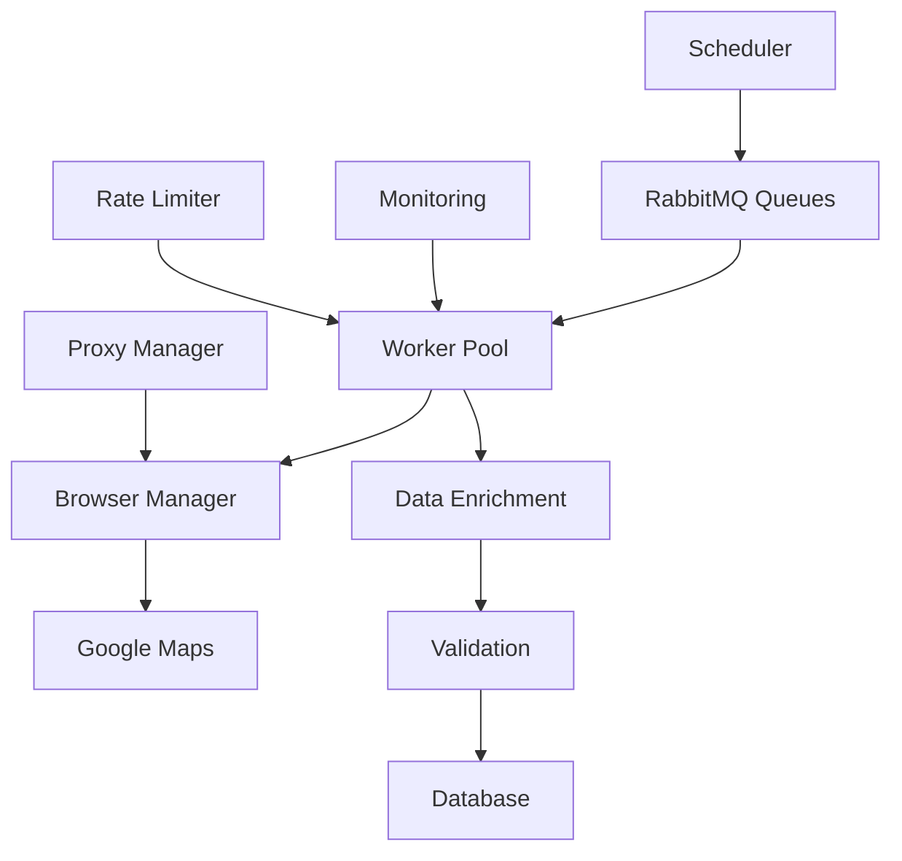

# Task Worker - Sistema de Busca de Leads via Google Maps

**Status:** PLANEJAMENTO  
**Data:** 2025-08-20  
**Responsável:** Equipe de Desenvolvimento  
**Prioridade:** ALTA  

---

## 📋 Objetivo

Desenvolver um sistema automatizado de coleta de leads B2B através do Google Maps, utilizando web scraping inteligente para capturar informações de empresas locais e enriquecê-las com dados de contato verificados.

### Meta Principal
Criar um worker/processo que execute buscas sistemáticas no Google Maps por segmentos específicos e regiões, coletando dados empresariais para alimentar a base de leads do LeadsRapido.

---

## 🎯 Escopo do Projeto

### Funcionalidades Core
1. **Busca Automatizada:** Pesquisar empresas por categoria/segmento + localização
2. **Extração de Dados:** Capturar informações públicas das empresas
3. **Enriquecimento:** Complementar dados com APIs externas
4. **Validação:** Verificar qualidade e veracidade dos dados
5. **Armazenamento:** Salvar leads na base de dados estruturada
6. **Monitoramento:** Acompanhar performance e detectar bloqueios

### Segmentos Prioritários
- Restaurantes e alimentação
- Serviços automotivos
- Clínicas e consultórios
- Escritórios de advocacia
- Imobiliárias
- Academias e fitness
- Salões de beleza
- Lojas de varejo
- Empresas de tecnologia
- Consultorias

---

## 🛠 Stack Tecnológico

### Backend Worker
- **Runtime:** Node.js 20+ TypeScript
- **Web Scraping:** Puppeteer + Playwright (fallback)
- **Queue System:** RabbitMQ + amqplib
- **Database:** PostgreSQL + Prisma ORM
- **APIs Externas:** ReceitaWS, Serasa, Google Places API
- **Proxy Management:** Bright Data ou Proxy-Cheap
- **Monitoring:** Winston + Prometheus

### Infraestrutura
- **Containers:** Docker + Docker Compose
- **Orchestration:** Kubernetes (produção)
- **Storage:** MinIO (S3-compatible) para screenshots/logs
- **Message Broker:** RabbitMQ para filas e rate limiting
- **Secrets:** HashiCorp Vault ou K8s Secrets

---

## 📊 Arquitetura do Sistema



### Componentes Principais

#### 1. **Search Scheduler**
- Agenda buscas por região/segmento
- Evita duplicação de esforços
- Controla frequência de execução
- Prioriza segmentos com maior demanda

#### 2. **Worker Pool**
- Pool de workers paralelos
- Cada worker gerencia um browser
- Auto-scaling baseado em carga
- Restart automático em caso de falha

#### 3. **Browser Manager**
- Configuração otimizada do Puppeteer
- Rotação de User-Agents
- Gestão de cookies/sessões
- Screenshot para debugging

#### 4. **Data Enrichment Engine**
- Busca CNPJ na Receita Federal
- Validação de telefones/emails
- Scoring de qualidade dos dados
- Categorização automática

#### 5. **Validation System**
- Detecção de duplicatas
- Verificação de dados obrigatórios
- Scoring de confiabilidade
- Filtros de qualidade

---

## 📋 Tarefas Detalhadas

### FASE 1: Infraestrutura Base (Sprint 1 - 2 semanas)

#### T1.1: Setup do Ambiente de Desenvolvimento
- [ ] **T1.1.1:** Configurar projeto Node.js + TypeScript
  - Criar structure de pastas (`/src`, `/workers`, `/scripts`, `/tests`)
  - Configurar ESLint, Prettier, Husky
  - Setup do Docker Compose para desenvolvimento
  - **Estimativa:** 1 dia
  - **Responsável:** Tech Lead
d
- [ ] **T1.1.2:** Configurar Banco de Dados
  - Criar schemas para leads, searches, logs
  - Implementar migrations com Prisma
  - Configurar indexes para performance
  - **Estimativa:** 1 dia
  - **Responsável:** Backend Dev

- [ ] **T1.1.3:** Setup do Sistema de Filas
  - Configurar RabbitMQ com exchanges e queues
  - Criar filas: `search-queue`, `enrichment-queue`, `validation-queue`
  - Management UI para monitoramento das filas
  - **Estimativa:** 2 dias
  - **Responsável:** DevOps

#### T1.2: Configuração do Web Scraping
- [ ] **T1.2.1:** Setup Puppeteer Otimizado
  - Configuração de browser headless
  - Pool de browsers reutilizáveis
  - Tratamento de memory leaks
  - **Estimativa:** 2 dias
  - **Responsável:** Scraping Specialist

- [ ] **T1.2.2:** Sistema de Proxies
  - Integração com provedor de proxies
  - Rotação automática de IPs
  - Health check dos proxies
  - **Estimativa:** 2 dias
  - **Responsável:** Scraping Specialist

- [ ] **T1.2.3:** Anti-Detection System
  - Rotação de User-Agents
  - Randomização de delays
  - Simulação de comportamento humano
  - **Estimativa:** 3 dias
  - **Responsável:** Scraping Specialist

### FASE 2: Core Scraping Engine (Sprint 2 - 3 semanas)

#### T2.1: Google Maps Search Engine
- [ ] **T2.1.1:** Módulo de Busca Base
  - Implementar busca por termo + localização
  - Navegação entre páginas de resultados
  - Extração de URLs dos estabelecimentos
  - **Estimativa:** 3 dias
  - **Responsável:** Backend Dev

- [ ] **T2.1.2:** Extração de Dados Empresariais
  - Scraping de nome, endereço, telefone
  - Captura de horário de funcionamento
  - Extração de fotos e avaliações
  - Coleta de categoria/segmento
  - **Estimativa:** 4 dias
  - **Responsável:** Scraping Specialist

- [ ] **T2.1.3:** Sistema de Parsing Robusto
  - Parser para diferentes layouts do GMaps
  - Fallbacks para mudanças na interface
  - Tratamento de dados incompletos
  - **Estimativa:** 3 dias
  - **Responsável:** Scraping Specialist

#### T2.2: Gestão de Sessões e Rate Limiting
- [ ] **T2.2.1:** Rate Limiting Inteligente
  - Controle de requests por minuto/hora
  - Backoff exponencial em caso de bloqueio
  - Monitoramento de CAPTCHAs
  - **Estimativa:** 2 dias
  - **Responsável:** Backend Dev

- [ ] **T2.2.2:** Gestão de Sessões
  - Persistência de cookies entre requests
  - Simulação de sessões longas
  - Logout/login automático quando necessário
  - **Estimativa:** 2 dias
  - **Responsável:** Scraping Specialist

### FASE 3: Data Enrichment (Sprint 3 - 2 semanas)

#### T3.1: Integração com APIs Externas
- [ ] **T3.1.1:** Integração ReceitaWS/Serasa
  - Busca de CNPJ por nome fantasia
  - Validação de dados empresariais
  - Enriquecimento com porte/setor
  - **Estimativa:** 3 dias
  - **Responsável:** Backend Dev

- [ ] **T3.1.2:** Validação de Contatos
  - Verificação de números de telefone
  - Validação de emails (se disponíveis)
  - Normalização de endereços
  - **Estimativa:** 2 dias
  - **Responsável:** Backend Dev

- [ ] **T3.1.3:** Sistema de Scoring
  - Algoritmo de qualidade dos dados
  - Classificação por confiabilidade
  - Priorização de leads premium
  - **Estimativa:** 3 dias
  - **Responsável:** Data Scientist

#### T3.2: Sistema de Categorização
- [ ] **T3.2.1:** Classificação Automática
  - ML para categorização de empresas
  - Mapeamento de segmentos
  - Tags automáticas por nicho
  - **Estimativa:** 4 dias
  - **Responsável:** Data Scientist

### FASE 4: Scheduler e Monitoring (Sprint 4 - 2 semanas)

#### T4.1: Sistema de Agendamento
- [ ] **T4.1.1:** Search Scheduler
  - Agendamento de buscas por região
  - Evitar sobreposição de esforços
  - Priorização por demanda
  - **Estimativa:** 3 dias
  - **Responsável:** Backend Dev

- [ ] **T4.1.2:** Job Management com RabbitMQ
  - Retry automático de jobs falhados via dead letter exchanges
  - Dead letter queue para análise de falhas
  - TTL automático para cleanup de jobs antigos
  - **Estimativa:** 2 dias
  - **Responsável:** Backend Dev

#### T4.2: Monitoring e Alertas
- [ ] **T4.2.1:** Dashboard de Monitoramento RabbitMQ
  - Métricas de filas em tempo real via Management UI
  - Alertas por Slack/Discord baseados em queue depth
  - Logs estruturados com correlation IDs
  - **Estimativa:** 3 dias
  - **Responsável:** DevOps

- [ ] **T4.2.2:** Health Checks
  - Verificação de workers ativos via heartbeat
  - Status de conexões RabbitMQ
  - Status de proxies e browsers
  - Alertas de performance
  - **Estimativa:** 2 dias
  - **Responsável:** DevOps

### FASE 5: Otimização e Produção (Sprint 5 - 2 semanas)

#### T5.1: Performance Optimization
- [ ] **T5.1.1:** Otimização de Queries
  - Indexes otimizados no PostgreSQL
  - Connection pooling
  - Cache de resultados frequentes
  - **Estimativa:** 2 dias
  - **Responsável:** DBA

- [ ] **T5.1.2:** Scaling Horizontal
  - Auto-scaling de workers
  - Load balancing
  - Sharding de dados se necessário
  - **Estimativa:** 3 dias
  - **Responsável:** DevOps

#### T5.2: Deployment e CI/CD
- [ ] **T5.2.1:** Pipeline de Deploy
  - GitHub Actions para CI/CD
  - Testes automatizados
  - Deploy em staging/produção
  - **Estimativa:** 2 dias
  - **Responsável:** DevOps

- [ ] **T5.2.2:** Backup e Recovery
  - Backup automático da base
  - Procedures de recovery
  - Testes de disaster recovery
  - **Estimativa:** 3 dias
  - **Responsável:** DevOps

---

## 📊 Schemas de Banco de Dados

**IMPORTANTE:** As tabelas abaixo serão adicionadas ao schema existente em `/database/schema.sql` para integrar o sistema de coleta com o CRM atual.

### Integração com Schema Existente
O sistema de worker utilizará as seguintes tabelas já existentes:
- `organizations` - Para multi-tenancy
- `users` - Para auditoria de operações  
- `lead_segments` - Para categorização automática
- `leads` - Destino final dos leads processados

### Novas Tabelas para o Worker

### Tabela: searches
```sql
CREATE TABLE searches (
  id UUID PRIMARY KEY DEFAULT uuid_generate_v4(),
  organization_id UUID NOT NULL REFERENCES organizations(id) ON DELETE CASCADE,
  query VARCHAR(255) NOT NULL,
  location VARCHAR(255) NOT NULL,
  segment_id UUID REFERENCES lead_segments(id),
  status VARCHAR(20) DEFAULT 'pending' CHECK (status IN ('pending', 'running', 'completed', 'failed')),
  started_at TIMESTAMPTZ,
  completed_at TIMESTAMPTZ,
  results_count INTEGER DEFAULT 0,
  error_message TEXT,
  worker_id VARCHAR(100),
  created_at TIMESTAMPTZ DEFAULT CURRENT_TIMESTAMP,
  updated_at TIMESTAMPTZ DEFAULT CURRENT_TIMESTAMP
);
```

### Tabela: raw_leads
```sql
CREATE TABLE raw_leads (
  id UUID PRIMARY KEY DEFAULT uuid_generate_v4(),
  search_id UUID NOT NULL REFERENCES searches(id) ON DELETE CASCADE,
  organization_id UUID NOT NULL REFERENCES organizations(id) ON DELETE CASCADE,
  
  -- Dados coletados do Google Maps
  name VARCHAR(255) NOT NULL,
  address TEXT,
  phone VARCHAR(20),
  website VARCHAR(500),
  rating DECIMAL(2,1),
  reviews_count INTEGER,
  category VARCHAR(100),
  business_hours JSONB,
  photos JSONB,
  google_place_id VARCHAR(255) UNIQUE,
  google_url TEXT,
  
  -- Status do processamento
  processing_status VARCHAR(50) DEFAULT 'raw' CHECK (processing_status IN ('raw', 'enriching', 'enriched', 'validated', 'imported', 'failed')),
  quality_score INTEGER DEFAULT 0 CHECK (quality_score >= 0 AND quality_score <= 100),
  
  -- Timestamps
  created_at TIMESTAMPTZ DEFAULT CURRENT_TIMESTAMP,
  updated_at TIMESTAMPTZ DEFAULT CURRENT_TIMESTAMP
) PARTITION BY HASH (organization_id);

-- Criar partições para raw_leads (mesma estratégia do leads)
DO $$
BEGIN
    FOR i IN 0..15 LOOP
        EXECUTE format('CREATE TABLE raw_leads_part_%s PARTITION OF raw_leads FOR VALUES WITH (modulus 16, remainder %s)', i, i);
    END LOOP;
END $$;
```

### Tabela: enriched_data
```sql
CREATE TABLE enriched_data (
  id UUID PRIMARY KEY DEFAULT uuid_generate_v4(),
  raw_lead_id UUID NOT NULL REFERENCES raw_leads(id) ON DELETE CASCADE,
  organization_id UUID NOT NULL REFERENCES organizations(id) ON DELETE CASCADE,
  
  -- Dados enriquecidos via APIs externas
  cnpj VARCHAR(18),
  company_size VARCHAR(50),
  sector VARCHAR(100),
  annual_revenue BIGINT,
  employees_count INTEGER,
  foundation_date DATE,
  legal_nature VARCHAR(100),
  verified_phone VARCHAR(20),
  verified_email VARCHAR(255),
  social_networks JSONB,
  technologies JSONB,
  
  -- Metadata do enriquecimento
  enrichment_source VARCHAR(100), -- 'receita_ws', 'serasa', 'google_places', etc.
  enrichment_confidence DECIMAL(3,2) DEFAULT 0.50,
  enrichment_cost DECIMAL(10,4) DEFAULT 0.00,
  
  created_at TIMESTAMPTZ DEFAULT CURRENT_TIMESTAMP,
  updated_at TIMESTAMPTZ DEFAULT CURRENT_TIMESTAMP
);
```

### Tabela: worker_logs
```sql
CREATE TABLE worker_logs (
  id UUID PRIMARY KEY DEFAULT uuid_generate_v4(),
  worker_id VARCHAR(100) NOT NULL,
  search_id UUID REFERENCES searches(id),
  level VARCHAR(10) NOT NULL CHECK (level IN ('debug', 'info', 'warn', 'error')),
  message TEXT NOT NULL,
  metadata JSONB,
  created_at TIMESTAMPTZ DEFAULT CURRENT_TIMESTAMP
);
```

### Processo de Integração dos Dados
1. **Coleta (raw_leads)** → 2. **Enriquecimento (enriched_data)** → 3. **Validação** → 4. **Importação (leads)**

A integração final transfere dados de `raw_leads` + `enriched_data` para a tabela `leads` existente, mantendo a compatibilidade com o CRM.

---

## 🔧 Configurações do Sistema

### Puppeteer Configuration
```typescript
const browserConfig = {
  headless: true,
  args: [
    '--no-sandbox',
    '--disable-setuid-sandbox',
    '--disable-dev-shm-usage',
    '--disable-accelerated-2d-canvas',
    '--no-first-run',
    '--no-zygote',
    '--disable-gpu',
    '--window-size=1920,1080'
  ],
  defaultViewport: {
    width: 1920,
    height: 1080
  }
};
```

### Rate Limiting Rules
```yaml
rate_limits:
  requests_per_minute: 30
  requests_per_hour: 1000
  concurrent_browsers: 5
  delay_between_requests: 2-5s
  backoff_on_error: exponential
  max_retries: 3
```

### RabbitMQ Configuration
```yaml
rabbitmq:
  connection:
    host: "localhost"
    port: 5672
    username: "leadsrapido"
    password: "secure_password"
    vhost: "/leadsrapido"
  
  exchanges:
    search_exchange:
      type: "direct"
      durable: true
    enrichment_exchange:
      type: "topic"
      durable: true
    dlx_exchange:
      type: "direct"
      durable: true
  
  queues:
    search_queue:
      durable: true
      exclusive: false
      auto_delete: false
      arguments:
        x-message-ttl: 3600000  # 1 hour
        x-dead-letter-exchange: "dlx_exchange"
    
    enrichment_queue:
      durable: true
      exclusive: false
      auto_delete: false
      arguments:
        x-message-ttl: 1800000  # 30 minutes
        x-dead-letter-exchange: "dlx_exchange"
    
    validation_queue:
      durable: true
      exclusive: false
      auto_delete: false
      arguments:
        x-message-ttl: 900000   # 15 minutes
        x-dead-letter-exchange: "dlx_exchange"
    
    dead_letter_queue:
      durable: true
      exclusive: false
      auto_delete: false

  prefetch_count: 1  # Process one message at a time per worker
  ack_timeout: 30000 # 30 seconds
```

### RabbitMQ Setup Commands
```bash
# Install RabbitMQ (Ubuntu/Debian)
sudo apt-get install rabbitmq-server

# Enable management plugin
sudo rabbitmq-plugins enable rabbitmq_management

# Create virtual host
sudo rabbitmqctl add_vhost /leadsrapido

# Create user
sudo rabbitmqctl add_user leadsrapido secure_password
sudo rabbitmqctl set_permissions -p /leadsrapido leadsrapido ".*" ".*" ".*"
sudo rabbitmqctl set_user_tags leadsrapido administrator

# Docker alternative
docker run -d --name rabbitmq \
  -p 5672:5672 \
  -p 15672:15672 \
  -e RABBITMQ_DEFAULT_USER=leadsrapido \
  -e RABBITMQ_DEFAULT_PASS=secure_password \
  -e RABBITMQ_DEFAULT_VHOST=/leadsrapido \
  rabbitmq:3-management
```

### Search Patterns
```typescript
const searchTemplates = [
  "{segment} em {city}",
  "{segment} {city} {state}",
  "{segment} próximo a {neighborhood}",
  "melhor {segment} {city}",
  "{segment} {city} telefone"
];
```

---

## 📈 Métricas e KPIs

### Performance Metrics
- **Leads coletados por hora:** Target > 500/h
- **Taxa de sucesso:** > 95%
- **Tempo médio por busca:** < 30s
- **Qualidade dos dados:** Score médio > 8/10
- **Duplicatas:** < 5%

### Business Metrics
- **Cobertura geográfica:** 100% capitais, 80% interior
- **Segmentos ativos:** > 50 categorias
- **Leads únicos mensais:** > 50.000
- **Taxa de conversão:** > 2%
- **ROI por lead:** R$ 2,50 custo vs R$ 25 valor

### Technical Metrics
- **Uptime do sistema:** > 99.5%
- **Memory usage:** < 2GB por worker
- **CPU usage:** < 80% média
- **Database response time:** < 100ms
- **Queue processing time:** < 5min média

---

## 🚨 Riscos e Mitigações

### Riscos Técnicos
1. **Bloqueio pelo Google Maps**
   - **Mitigação:** Proxy rotation, delays aleatórios, comportamento humano simulado
   
2. **Mudanças na Interface**
   - **Mitigação:** Multiple selectors, fallback strategies, automated tests
   
3. **Rate Limiting Agressivo**
   - **Mitigação:** Distributed workers, smart scheduling, queue management

### Riscos de Negócio
1. **Qualidade dos Dados**
   - **Mitigação:** Multiple validation layers, human review samples, feedback loops
   
2. **Compliance/Legal**
   - **Mitigação:** LGPD compliance, public data only, opt-out mechanisms

### Riscos Operacionais
1. **Escalabilidade**
   - **Mitigação:** Horizontal scaling, load testing, performance monitoring
   
2. **Manutenção**
   - **Mitigação:** Automated updates, monitoring alerts, documentation

---

## 📅 Timeline de Entrega

| Fase | Duração | Início | Término | Entregáveis |
|------|---------|--------|---------|-------------|
| **FASE 1** | 2 semanas | 20/08 | 02/09 | Infraestrutura base funcional |
| **FASE 2** | 3 semanas | 03/09 | 23/09 | Scraping engine completo |
| **FASE 3** | 2 semanas | 24/09 | 07/10 | Data enrichment ativo |
| **FASE 4** | 2 semanas | 08/10 | 21/10 | Monitoring e scheduling |
| **FASE 5** | 2 semanas | 22/10 | 04/11 | Sistema em produção |

**Data de Go-Live:** 04/11/2025

---

## 🔐 Aspectos de Segurança

### Data Protection
- Criptografia de dados sensíveis
- Anonimização de informações pessoais
- Logs auditáveis de acesso
- Backup criptografado

### Access Control
- Autenticação multifator para admin
- Roles e permissões granulares
- API keys com escopo limitado
- Network segmentation

### Compliance
- LGPD compliance total
- Terms of service claros
- Opt-out mechanisms
- Data retention policies

---

## 📚 Documentação Adicional

### Para Desenvolvimento
- [ ] API Documentation (Swagger)
- [ ] Database Schema Documentation
- [ ] Development Setup Guide
- [ ] Testing Strategy Document

### Para Operação
- [ ] Deployment Guide
- [ ] Monitoring Playbook
- [ ] Incident Response Procedures
- [ ] Performance Tuning Guide

### Para Negócio
- [ ] User Manual
- [ ] Data Quality Guidelines
- [ ] Compliance Documentation
- [ ] ROI Analysis Report

---

**Criado por:** Equipe LeadsRapido  
**Última atualização:** 20/08/2025  
**Versão:** 1.0  
**Status:** Em planejamento
